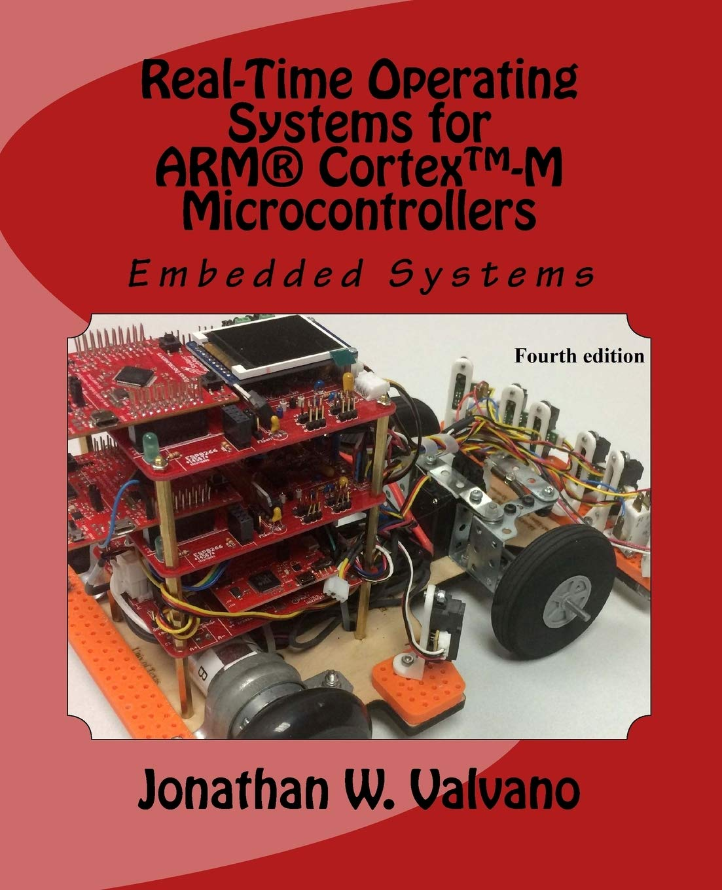
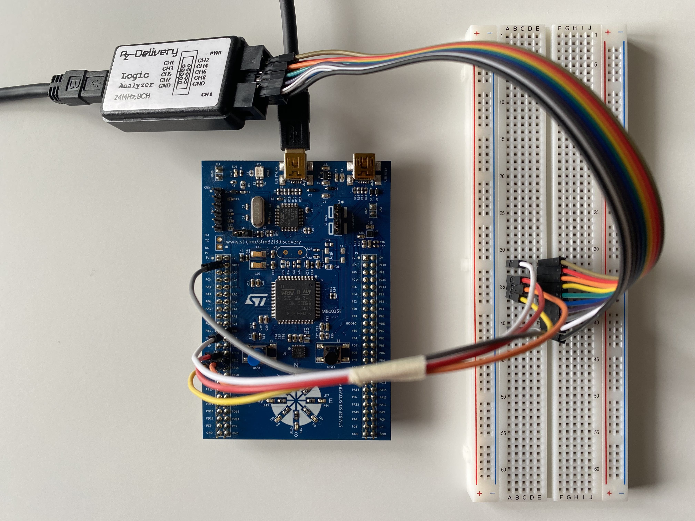
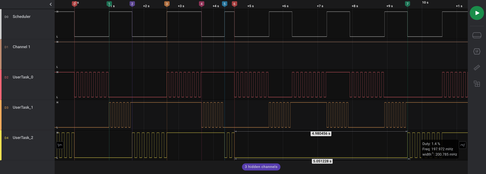

# A Tiny RTOS Simply Explained

This is a tiny Real-Time Operating System written for [STM32F3 microcontrollers](https://www.st.com/en/microcontrollers-microprocessors/stm32f3-series.html).



The work is heavily inspired by the book [Real-Time Operating Systems
for ARM® Cortex™-M Microcontrollers, by Jonathan W. Valvano](https://www.amazon.com/Embedded-Systems-Real-Time-Operating-Microcontrollers/dp/1466468866/ref=sr_1_1),
which targets [MSP432](https://www.ti.com/tool/MSP-EXP432E401Y) and [TM4C](https://www.ti.com/tool/EK-TM4C123GXL) microcontrollers from Texas Instruments:
like for the STM32F3 Series, those MCUs are based on [32-bit ARM Cortex-M4](https://developer.arm.com/Processors/Cortex-M4) processors.  
<br clear="left"/>

To be more specific, this RTOS has been developed on the [STM32F3DISCOVERY](https://www.st.com/en/evaluation-tools/stm32f3discovery.html) board, so you may want to verify the peripherals and GPIO pins used if you want to run it on a different board.

There are of course some differences between what's been presented in the book and what's been developed here:
first, different boards feature different peripherals, and different manifacturers provide different
libraries to interface with them, and second, different coding styles led to different outcomes.  
Nonetheless, if you pick up the book, I'm sure you can follow along quite easily 📚

Last but not least, if this README taught you something new, consider gifting it a star! ⭐


	
## README Sections

- [RTOS Features Overview](#rtos-features-overview)
- [Building and Flashing](#building-and-flashing)
- [The RTOS Simply Explained](#the-rtos-simply-explained)
    - [0. What is an RTOS?](#0-what-is-an-rtos)
    - [1. Initialize the MCU](#1-initialize-the-mcu)
    - [2. Initialize the linked list of TCBs](#2-initialize-the-linked-list-of-tcbs)
    - [3. Initialize and start the periodic timer for the scheduler](#3-initialize-and-start-the-periodic-timer-for-the-scheduler)
    - [4. Start the first task](#4-start-the-first-task)
    - [5. Perform the context switch when the periodic timer's interrupt triggers](#5-perform-the-context-switch-when-the-periodic-timers-interrupt-triggers)
- [Bonus Steps](#bonus-steps)
    - [6. Allow a task to suspend earlier](#6-allow-a-task-to-suspend-earlier)
    - [7. Allow a task to sleep](#7-allow-a-task-to-sleep)
- [Inspecting the RTOS with the Logic Analyzer](#inspecting-the-rtos-with-the-logic-analyzer)
- [Added Features on top of the barebone-os](#added-features-on-top-of-the-barebone-os)
- [Features Missing](#features-missing)
- [Discussion on Reddit](#discussion-on-reddit)
- [Diving Into the Project - Naming Convention](#diving-into-the-project---naming-convention)
- [Diving Into the Project - Error Handling](#diving-into-the-project---error-handling)
- [Diving Into the Project - The InstrumentTrigger Macro](#diving-into-the-project---the-instrumenttrigger-macro)
- [Diving Into the Project - Debugging Hard Faults](#diving-into-the-project---debugging-hard-faults)

## RTOS Features Overview

As anticipated in the introduction, this is a simple RTOS that provides a limited number of features:

-   Thread creation, suspension, sleeping, and killing

-   Fixed stack size for each thread (default to 400 bytes)

-   Preemptive priority scheduling

-   Blocking semaphores (as opposed to spin-lock semaphores)

## Building and Flashing

The CMake setup follows the guidelines provided by this [repository](https://github.com/MaJerle/stm32-cube-cmake-vscode).

To run the software on your board,
first [install all the required tools](https://github.com/MaJerle/stm32-cube-cmake-vscode#tools-installation).

Then clone the repo, configure CMake, build the executable, and flash it to the board 🏗️

```sh
# Clone the repo
git clone https://github.com/dehre/stm32f3-tiny-rtos
cd stm32f3-tiny-rtos

# Configure CMake
cmake \
    --no-warn-unused-cli \
    -DCMAKE_EXPORT_COMPILE_COMMANDS=ON \
    -DCMAKE_BUILD_TYPE=Debug \
    -DCMAKE_TOOLCHAIN_FILE:FILEPATH=cmake/gcc-arm-none-eabi.cmake \
    -Bbuild/Debug \
    -G Ninja

# Build
cmake --build build/Debug -j 8

# Flash
STM32_Programmer_CLI --connect port=swd --download build/Debug/stm32f3-tiny-rtos.elf -hardRst
```

## The RTOS Simply Explained

This README section tries to explain how the RTOS works before any bells and whistles are added to it 🔔  
If you want to follow along, clone the repo and [checkout it out at the **barebone-os** tag](https://github.com/dehre/stm32f3-tiny-rtos/commit/03e20f0cde2a6ea5b8408ee62aa3a604084b8c15).

Other features, such as dynamic tasks creation and killing, semaphores, and better scheduling algorithms,
although not explained in detail here, become much easier to figure out once the fundamentals are clear.

To ease the explanation further, this section is broken down into 6 steps:

0. What is an RTOS?

1. Initialize the MCU

2. Initialize the linked list of TCBs

3. Initialize and start the periodic timer for the scheduler

4. Start the first task

5. Perform the context switch when the periodic timer's interrupt triggers

#### 0. What is an RTOS?

Before going too far, what is a Real Time Operating System?  
[Quoting](https://www.highintegritysystems.com/rtos/what-is-an-rtos/):  

> A Real Time Operating System, commonly known as an RTOS, is a software component that rapidly switches between tasks,
  giving the impression that multiple programs are being executed at the same time on a single processing core.
>
> In actual fact the processing core can only execute one program at any one time,
  and what the RTOS is actually doing is rapidly switching between individual programming threads (or tasks)
  to give the impression that multiple programs are executing simultaneously.

*Actually, a fully fledged RTOS offers [many more features](https://docs.zephyrproject.org/latest/introduction/index.html#distinguishing-features), but we keep it simple here.*

So, what is a task?

A task is a small piece of program which competes with other tasks to get the CPU resources.  
It's just a regular function that runs continuously within an infinite loop and never returns.

*Core/Src/user_tasks.c*

```c
void UserTask_0(void)
{
    while (1)
    {
        /* do something */
    }
}
```

**Remark:**  
The words `Task` and `Thread` are used interchangeably throughout the project,
even though their meaning isn't exactly the same.  
Generally, a thread runs in a [virtual address space](https://en.wikipedia.org/wiki/Virtual_address_space), whereas a task runs in a physical one.  
Given that this RTOS, [like others](https://www.freertos.org/FreeRTOS_Support_Forum_Archive/November_2016/freertos_Free_RTOS_Memory_Management_59ed41adj.html), doesn't provide virtual address spaces, it makes no difference here.

#### 1. Initialize the MCU

For the MCU to perform any work, the NVIC (Nested Vectored Interrupt Controller), the low-level hardware, and the system clock need to be initialized.  
The fn [`HAL_Init`](https://github.com/STMicroelectronics/stm32f3xx_hal_driver) also initializes the SysTick periodic timer with period of 1 ms:
it will be used later for `OS_Sleep`.

*Core/Src/main.c*

```c
int main(void)
{
    HAL_Init();
    SystemClock_Config();
    /* ...omitted... */
}
```

#### 2. Initialize the linked list of TCBs

Every task run by the RTOS has a `TCB`.  
A `TCB` (Thread Control Block) is a `struct` encapsulating the state of the task.  

*Core/Src/os.c*

```c
typedef struct TCB
{
    uint32_t *sp;     /* Stack pointer, valid for threads not running */
    struct TCB *next; /* Pointer to circular-linked-list of TCBs */
} TCB_t;
```

A task is assigned its own stack, and the `sp` field in the `TCB` points to the top of it.  
Stacks for the tasks are carved out of a static array, named `Stacks`, and have a fixed size of 100 32-bit words (400 bytes).

The fn `OS_AddThreads` first links together the `TCB`s in a circular list using the `next` field.

Then it calls `OS_SetInitialStack`, which sets up the stack for each thread as if it had already been running and then suspended.  
Dummy values, such as `0x07070707`, are simply chosen to facilitate debugging.  

Finally, it points the global variable `RunPt` to an arbitrary `TCB`.

*Core/Src/main.c*

```c
int main(void)
{
    /* ...omitted... */
    OS_AddThreads(UserTask_0, UserTask_1, UserTask_2);
    /* ...omitted... */
}
```

*Core/Src/os.c*

```c
#define NUMTHREADS 3  /* Maximum number of threads */
#define STACKSIZE 100 /* Number of 32-bit words in each TCB's stack */

static TCB_t TCBs[NUMTHREADS];
static uint32_t Stacks[NUMTHREADS][STACKSIZE];

/* Pointer to the currently running thread */
TCB_t *RunPt;

static void OS_SetInitialStack(uint32_t tcb_idx)
{
    /* From the "STM32 Cortex-M4 Programming Manual" on page 23:
     * attempting to execute instructions when  the T bit is 0 results in a fault or lockup */
    Stacks[tcb_idx][STACKSIZE - 1] = 0x01000000; /* Thumb Bit (PSR) */
    // Stacks[tcb_idx][STACKSIZE - 2] =           /* R15 (PC) -> set later in fn OS_AddThreads
    Stacks[tcb_idx][STACKSIZE - 3] = 0x14141414;  /* R14 (LR) */
    Stacks[tcb_idx][STACKSIZE - 4] = 0x12121212;  /* R12 */
    Stacks[tcb_idx][STACKSIZE - 5] = 0x03030303;  /* R3 */
    Stacks[tcb_idx][STACKSIZE - 6] = 0x02020202;  /* R2 */
    Stacks[tcb_idx][STACKSIZE - 7] = 0x01010101;  /* R1 */
    Stacks[tcb_idx][STACKSIZE - 8] = 0x00000000;  /* R0 */
    Stacks[tcb_idx][STACKSIZE - 9] = 0x11111111;  /* R11 */
    Stacks[tcb_idx][STACKSIZE - 10] = 0x10101010; /* R10 */
    Stacks[tcb_idx][STACKSIZE - 11] = 0x09090909; /* R9 */
    Stacks[tcb_idx][STACKSIZE - 12] = 0x08080808; /* R8 */
    Stacks[tcb_idx][STACKSIZE - 13] = 0x07070707; /* R7 */
    Stacks[tcb_idx][STACKSIZE - 14] = 0x06060606; /* R6 */
    Stacks[tcb_idx][STACKSIZE - 15] = 0x05050505; /* R5 */
    Stacks[tcb_idx][STACKSIZE - 16] = 0x04040404; /* R4 */

    TCBs[tcb_idx].sp = &Stacks[tcb_idx][STACKSIZE - 16]; /* Thread's stack pointer */
}

void OS_AddThreads(void (*task0)(void), void (*task1)(void), void (*task2)(void))
{
    TCBs[0].next = &(TCBs[1]);
    TCBs[1].next = &(TCBs[2]);
    TCBs[2].next = &(TCBs[0]);

    OS_SetInitialStack(0);
    Stacks[0][STACKSIZE - 2] = (int32_t)task0; /* PC */
    OS_SetInitialStack(1);
    Stacks[1][STACKSIZE - 2] = (int32_t)task1; /* PC */
    OS_SetInitialStack(2);
    Stacks[2][STACKSIZE - 2] = (int32_t)task2; /* PC */

    /* Thread 0 will run first */
    RunPt = &(TCBs[0]);
}
```

#### 3. Initialize and start the periodic timer for the scheduler

The fn `OS_Init` initializes and starts the periodic `SchedlTimer` timer, which triggers an interrupt when its count reaches zero.  
The ISR (Interrupt Service Routine) will then be used by the OS to regain control of the CPU and perform the context switch.
Other details about the timer don't really matter.

*Core/Src/main.c*

```c
int main(void)
{
    /* ...omitted... */
    OS_Init(THREADFREQ);
    OS_Launch();
    panic(); /* This statement should not be reached */
}
```

*Core/Src/os.c*

```c
void OS_Init(uint32_t scheduler_frequency_hz)
{
    SchedlTimer_Init(scheduler_frequency_hz);
}

void OS_Launch(void)
{
    SchedlTimer_Start();
    /* ...omitted... */
}
```

#### 4. Start the first task

The fn `OSAsm_Start` is called.  
It has to be written in Assembly, because CPU registers cannot be accessed from C.

*Core/Src/os.c*

```c
void OS_Launch(void)
{
    /* ...omitted... */
    OSAsm_Start();
    panic(); /* This statement should not be reached */
}
```

The function first dereferences `RunPt` and gets the address of the thread's `SP` (stack pointer),
which is placed first in the `TCB` struct.  
Then it pops the stack's values on the CPU registers.

*Core/Src/os_asm.s*

```s
OSAsm_Start:
    CPSID   I                  /* disable interrupts                                               */
    LDR     R0, =RunPt         /* R0 = &RunPt; // TCB_t**  R0 = &RunPt                             */
    LDR     R1, [R0]           /* R1 = *R0;    // TCB_t*   R1 = RunPt                              */
    LDR     SP, [R1]           /* SP = *R1;    // uint32_t SP = *(RunPt.sp)                        */
                               /* now we switched to the thread's stack, which we populated before */
    POP     {R4-R11}           /* pop regs R4-R11                                                  */
    POP     {R0-R3}            /* pop regs R0-R3                                                   */
    POP     {R12}              /* pop reg  R12                                                     */
    /* ...omitted... */
```

Finally, it pops the first task's address to `LR` (Link Register), and jumps to it.  
Consequently, the fn `OSAsm_Start` never returns from `OS_Start`.  
The fn `UserTask_0` starts running.

*Core/Src/os_asm.s*

```s
OSAsm_Start:
    /* ...omitted... */
    POP     {LR}               /* pop PC to the link register (start location)                     */
    POP     {R1}               /* discard PSR                                                      */
    CPSIE   I                  /* enable interrupts                                                */
    BX      LR                 /* start first thread                                               */
```

*Core/Src/user_tasks.c*

```c
void UserTask_0(void)
{
    while (1)
    {
        /* do something */
    }
}
```

#### 5. Perform the context switch when the periodic timer's interrupt triggers

After `UserTask_0` has run for a while, the periodic `SchedlTimer` counts to zero,
the interrupt triggers, and the CPU jumps to the ISR (Interrupt Service Routine).

Who determines which function handles this interrupt?  
It's determined by the vector table placed at memory address `0x0000`.

*Core/Startup/startup_stm32f303vctx.s*

```s
/******************************************************************************
*
* The minimal vector table for a Cortex-M4.  Note that the proper constructs
* must be placed on this to ensure that it ends up at physical address 0x0000.0000.
*
******************************************************************************/

.section  .isr_vector,"a",%progbits
.type     g_pfnVectors, %object

g_pfnVectors:
	.word	_estack
	.word	Reset_Handler
	.word	NMI_Handler
	.word	HardFault_Handler
	/* ...omitted... */
	.word	TIM2_IRQHandler
	/* ...omitted... */
	.weak	TIM2_IRQHandler
	.thumb_set TIM2_IRQHandler,Default_Handler
```

The fn `TIM2_IRQHandler`, defined as weak symbol in `startup_stm32f303vctx.s`, is later overwritten in `os_asm.s`
and is responsible for the context switch.

*Core/Src/os_asm.s*

```s
/**
 * For clarity, the fn OSAsm_ThreadSwitch is exported as TIM2_IRQHandler, so that the vector table
 * in startup_stm32f303vctx.s doesn't need to be modified.
 */
.set TIM2_IRQHandler, OSAsm_ThreadSwitch

OSAsm_ThreadSwitch:
    /* ...omitted... */
```

First, according to the [AAPCS](https://community.arm.com/arm-community-blogs/b/architectures-and-processors-blog/posts/on-the-aapcs-with-an-application-to-efficient-parameter-passing) (ARM Architecture Procedure Call Standard),
upon every function call the registers `R0-R3`,`R12`,`LR`,`PC`,`PSR` are automatically saved on the stack.  
Remember, the `SP` (Stack Pointer) is still pointing to the first thread's stack.

Then, the remaining registers `R4-R11` are manually pushed to the stack
and `RunPt.sp` updated with the latest `SP` (stack pointer) value.

*Core/Src/os_asm.s*

```s
OSAsm_ThreadSwitch:
                                    /* save R0-R3,R12,LR,PC,PSR                                    */
    CPSID   I                       /* prevent interrupt during context-switch                     */
    PUSH    {R4-R11}                /* save remaining regs R4-R11                                  */
    LDR     R0, =RunPt              /* R0 = &RunPt;  // TCB_t** R0  = &RunPt                       */
    LDR     R1, [R0]                /* R1 = *R0;     // TCB_t*  R1  = RunPt                        */
    STR     SP, [R1]                /* *R1 = SP;     // *(RunPt.sp) = SP                           */
    /* ...omitted... */
```

The first thread's context is now saved.

The interrupt flag is then cleared and `RunPt` updated in a simple round-robin fashion.  
The fn `OS_Scheduler` is written in C, so that it becomes easier to update as the project grows.

Finally, as before, the new `RunPt` is dereferenced to get the address of the new thread's `SP` (stack pointer),  
the stack's values are popped to the CPU registers, and the CPU returns from the interrupt.  
Before the function exits, following the [AAPCS](https://community.arm.com/arm-community-blogs/b/architectures-and-processors-blog/posts/on-the-aapcs-with-an-application-to-efficient-parameter-passing),
the `PC` (Program Counter), along with `R0-R3`,`R12`,`LR`,`PSR`
are restored from the new thread's stack, so the next task `UserTask_1` starts running.

*Core/Src/os_asm.s*

```s
OSAsm_ThreadSwitch:
    /* ...omitted... */
    PUSH    {R0, LR}                /* push R0 and LR, so that fn calls don't loose them           */
    BL      SchedlTimer_ClearITFlag /* clear SchedlTimer interrupt flag                            */
    BL      OS_Scheduler            /* call OS_Scheduler, RunPt is updated                         */
    POP     {R0, LR}                /* restore R0 and LR                                           */

    LDR     R1, [R0]                /* R1 = *R0;     // TCB_t*   R1 = RunPt                        */
    LDR     SP, [R1]                /* SP = *R1;     // uint32_t SP = *(RunPt.sp)                  */
                                    /* now we switched to the new thread's stack                   */
    POP     {R4-R11}                /* restore regs R4-R11                                         */
    CPSIE   I                       /* tasks run with interrupts enabled                           */
    BX      LR                      /* restore R0-R3,R12,LR,PC,PSR                                 */
```

*Core/Src/os.c*

```c
void OS_Scheduler(void)
{
    RunPt = RunPt->next;
}
```

*Core/Src/user_tasks.c*

```c
void UserTask_1(void)
{
    while (1)
    {
        /* do something */
    }
}
```

Now the RTOS will keep switching between user tasks each time the periodic `SchedlTimer` counts to zero.

## Bonus Steps

With the core concepts understood, adding simple features on top of the RTOS becomes quite straightforward.

#### 6. Allow a task to suspend earlier

A task can decide to suspend before the end of its scheduled time slice and grant the CPU to the next task.

*Core/Src/user_tasks.c*

```c
void UserTask_1(void)
{
    while (1)
    {
        for (uint32_t i = 0; i <= 12; i++)
        {
            /* do something */
        }
        OS_Suspend();
    }
}
```

The fn `OS_Suspend` only needs to set the periodic `SchedlTimer`'s counter to zero, which in turn
triggers the interrupt, calls the ISR, and switches to the next thread (back to step 5).

*Core/Src/os.c*

```c
void OS_Suspend(void)
{
    SchedlTimer_ResetCounter();
}
```

#### 7. Allow a task to sleep

A task can decide to enter the sleep state for an arbitrary amount of milliseconds.

*Core/Src/user_tasks.c*

```c
void UserTask_2(void)
{
    uint32_t count = 0;
    while (1)
    {
        count++;
        if (count % 35 == 0) {
            OS_Sleep(4500);
        }
    }
}
```

This information needs to be recorded in the `TCB` struct: 
the thread will be sleeping if `sleep` is greater than zero.

*Core/Src/os.c*

```c
typedef struct TCB
{
    uint32_t *sp;     /* Stack pointer, valid for threads not running */
    struct TCB *next; /* Pointer to circular-linked-list of TCBs */
    uint32_t sleep;   /* Sleep duration in ms, zero means not sleeping */
} TCB_t;
```

To start sleeping, the fn `OS_Sleep` first sets the desired sleep value, then suspends the task.

*Core/Src/os.c*

```c
void OS_Sleep(uint32_t sleep_duration_ms)
{
    RunPt->sleep = sleep_duration_ms;
    OS_Suspend();
}
```

The `SysTick` timer, which was initialized by `HAL_Init` back at step 1,
is responsible for decrementing `sleep` every millisecond in all `TCB`s.

*Core/Src/stm32f3xx_it.c*

```c
void SysTick_Handler(void)
{
    /* ...omitted... */
    OS_DecrementTCBsSleepDuration();
}
```

*Core/Src/os.c*

```c
void OS_DecrementTCBsSleepDuration(void)
{
    for (size_t tcb_idx = 0; tcb_idx < NUMTHREADS; tcb_idx++)
    {
        if (TCBs[tcb_idx].sleep > 0)
        {
            TCBs[tcb_idx].sleep -= 1;
        }
    }
}
```

Finally, the scheduler is updated to skip all sleeping threads.

*Core/Src/os.c*

```c
void OS_Scheduler(void)
{
    RunPt = RunPt->next;
    while ((RunPt->sleep) > 0)
    {
        RunPt = RunPt->next;
    }
}
```

Sleeping will not be precise.  
The thread may sleep up to `sleep_time_ms + (number_running_threads * max_preempt_time_ms)`,
depending on how many threads are scheduled to run before the awaked thread is run again.

## Inspecting the RTOS with the Logic Analyzer

Let's now inspect how the [**barebone-os**](https://github.com/dehre/stm32f3-tiny-rtos/commit/03e20f0cde2a6ea5b8408ee62aa3a604084b8c15)
behaves using the logic analyzer 🔬

The pins are connected as shown:

```
   ______________________                        ________________
  |                      |                      |                |
  |      Scheduler  (PB0)|______________________|CH0             |
  |                      |                      |                |
  |     UserTask_0 (PE11)|______________________|CH2             |
  |                      |                      |                |
  |     UserTask_1 (PE12)|______________________|CH3             |
  |                      |                      |                |
  |     UserTask_2 (PE13)|______________________|CH4             |
  |                      |                      |                |
  |                   GND|______________________|GND             |
  |                      |                      |                |
  |_STM32F3DISCOVERY_____|                      |_Logic_Analyzer_|

```

The pin `PB0` is toggled each time the scheduler is invoked.  
The other three pins are toggled by the user tasks.  
In short:
- `UserTask_0` just toggles `PE11` every 60ms for its entire time slice
- `UserTask_1` toggles `PE12` twelve times, then suspends
- `UserTask_2` toggles `PE13` thirty-five times, then sleeps for 4500ms

*Core/Src/user_tasks.c*

```c
void UserTask_0(void)
{
    InstrumentTriggerPE11_Init();
    while (1)
    {
        InstrumentTriggerPE11_Toggle();
        HAL_Delay(60);
    }
}

void UserTask_1(void)
{
    InstrumentTriggerPE12_Init();
    while (1)
    {
        for (uint32_t i = 0; i <= 12; i++)
        {
            InstrumentTriggerPE12_Toggle();
            HAL_Delay(50);
        }
        OS_Suspend();
    }
}

void UserTask_2(void)
{
    InstrumentTriggerPE13_Init();
    uint32_t count = 0;
    while (1)
    {
        InstrumentTriggerPE13_Toggle();
        count++;
        if (count % 35 == 0)
            OS_Sleep(4500);
        else
            HAL_Delay(70);
    }
}
```

Here's the result:


0. The scheduler is called, `UserTask_0` starts running
1. After 1 second, `SchedlTimer` counts to zero, a context switch happens, and `UserTask_1` starts running
2. `UserTask_1` suspends before the end of its time slice, `UserTask_2` starts running
3. `UserTask_2` runs until the end of its time slice because it hasn't counted to 35 yet, then `UserTask_0` starts running again
4. After 1 second, `SchedlTimer` counts to zero, a context switch happens, and `UserTask_1` starts running
5. `UserTask_1` suspends before the end of its time slice, `UserTask_2` starts running
6. `UserTask_2` counts to 35 and starts sleeping for 4500ms, then `UserTask_0` starts running
7. `UserTask_2` wakes up after (more than) 4500ms and starts counting again from 0


**Remark:**  
If you want to inspect the logic analyzer session yourself, [install Logic2 from Saleae](https://www.saleae.com/downloads/)
and open the file [`readme_assets/saleae-logic2-session.sal`](https://github.com/dehre/stm32f3-tiny-rtos/blob/main/readme_assets/saleae-logic2-session.sal).

## Added Features on top of the barebone-os

More features have been added on top of the
[**barebone-os**](https://github.com/dehre/stm32f3-tiny-rtos/commit/03e20f0cde2a6ea5b8408ee62aa3a604084b8c15)
described above:

-   [Dynamic thread creation](https://github.com/dehre/stm32f3-tiny-rtos/blob/main/Core/Src/os.c#L220) and [killing](https://github.com/dehre/stm32f3-tiny-rtos/blob/main/Core/Src/os.c#L307).  
    In short, any thread can spawn a new thread at runtime and/or kill itself.
    As before, the stack size is fixed to 400 bytes.
    To avoid any dynamic memory allocation, the maximum number of threads that can be created is defined at compile-time.

-   [Semaphores](https://github.com/dehre/stm32f3-tiny-rtos/blob/main/Core/Src/os.c#L329).  
    Threads can block waiting on a semaphore, and they won't be picked by the scheduler to run until that semaphore is signaled.
    The project includes a [multi-consumer multi-producer FIFO queue](https://github.com/dehre/stm32f3-tiny-rtos/blob/main/Core/Src/fifo_queue.c) built on top of the `OS_Semaphore`,
    as well as an [example of switch debounce](https://github.com/dehre/stm32f3-tiny-rtos/blob/main/Core/Src/onboard_user_button.c) (the onboard switch).

-   [Priority Scheduling](https://github.com/dehre/stm32f3-tiny-rtos/blob/main/Core/Src/os.c#L262).  
    Upon creation, the user can assign each task a fixed priority from 0 (highest) to 255 (lowest).
    The rules for the scheduler are simple:
    -   if `priority(task_a) > priority(task_b)` , `task_a` runs
    -   if `priority(task_b) > priority(task_a)` , `task_b` runs
    -   if `priority(task_a) == priority(task_b)`, `task_a` and `task_b` are run in round-robin fashion.

## Features Missing

Of course, plenty of features are missing.
Perhaps the most relevant are:

-   [Memory Protection](https://www.freertos.org/FreeRTOS-MPU-memory-protection-unit.html) (stack overflow protection):
    if a task allocates on the stack more than the predefined number of bytes (400 by default), the OS will happily start overwriting another thread's stack, or throw a segmentation fault.

-   [Priority Inheritance](https://en.wikipedia.org/wiki/Priority_inheritance):
    an high priority task could starve waiting for a semaphore to be signaled from a low priority one.

-   [Aging](<https://en.wikipedia.org/wiki/Aging_(scheduling)>): low priority tasks may never be scheduled to run.

-   [Address space virtualization](https://en.wikipedia.org/wiki/Virtual_address_space):
    like most other RTOSes, tasks don't have their own address space.
    Quoting from this [post](https://www.freertos.org/FreeRTOS_Support_Forum_Archive/November_2016/freertos_Free_RTOS_Memory_Management_59ed41adj.html):
    > As far as I know, NO, FreeRTOS does not deal with ‘virtual’ spaces/memory. In part, because virtual memory is the enemy of Real-Time (the Linux Real Time extensions as far as I know just lock the real-time parts into memory), the problem is that paging in virtual memory adds significant unpredictability to timing.
    
## Discussion on Reddit

This project received [a lot of relevant and well-written feedback on Reddit](https://www.reddit.com/r/embedded/comments/voxdj4/a_tiny_rtos_simply_explained), which adds great value to this README.  
If you've read this far, consider checking it out too.

## Diving Into the Project - Naming Convention

As this RTOS uses the [STM32 HAL Driver](https://github.com/STMicroelectronics/stm32f3xx_hal_driver),
all code sticks to its naming convention to avoid a weird reading experience.

In short:

```c
/* Global function and variable */
void MyModule_GlobalFn(void);
uint32_t MyModule_GlobalVar;

/* Static function and variable (internal linkage) */
static void StaticFn(void);
static uint32_t StaticVar;

/* Local function and variable */
void (*local_fn_ptr)(void);
uint32_t local_var;
```

## Diving Into the Project - Error Handling

To enhance readability and simplify development, the RTOS panics as soon as an error occurs, instead of bubbling it up.  
The fn `panic` in turn calls the [`BKPT` instruction](https://developer.arm.com/documentation/dui0473/m/arm-and-thumb-instructions/bkpt),
so that pinpointing and fixing bugs becomes as quick as possible.

[The macros `assert_or_panic` and `IFERR_PANIC`](https://github.com/dehre/stm32f3-tiny-rtos/blob/main/Core/Inc/iferr.h)
helped with the chore:

```c
void panic(void)
{
    __disable_irq();
    __asm("BKPT 1");
}

#define assert_or_panic(expr) ((expr) ? (void)0U : panic())

#define IFERR_PANIC(x)               \
    do                               \
    {                                \
        HAL_StatusTypeDef err = (x); \
        if (err != HAL_OK)           \
        {                            \
            panic();                 \
        }                            \
    } while (0)
```

Usage:

```c
assert_or_panic(arg > 0);

IFERR_PANIC(some_fn(arg));
```

## Diving Into the Project - The InstrumentTrigger Macro

A debugging heartbeat is a nice and minimally intrusive tool for profiling embedded software
with an oscilloscope or logic analyzer.  
It's used multiple time across this codebase.

To reduce boilerplate code, [the module `instrument_trigger`](https://github.com/dehre/stm32f3-tiny-rtos/blob/main/Core/Inc/instrument_trigger.h)
provides the macro `InstrumentTrigger_Create`, which generates functions to
initialize a GPIO pin as push-pull output and toggle it.

Usage:

```c
#include "instrument-trigger.h"
InstrumentTrigger_Create(E, 13);

/**
 * Now these functions are available:
 *
 * void InstrumentTriggerPE13_Init(void);
 * void InstrumentTriggerPE13_Set(void);
 * void InstrumentTriggerPE13_Reset(void);
 * void InstrumentTriggerPE13_Toggle(void);
 * void InstrumentTriggerPE13_Read(void);
 */

int some_fn(void)
{
    InstrumentTriggerPE13_Init();
    while (1)
    {
        InstrumentTriggerPE13_Toggle();
        HAL_Delay(1000);
    }
}
```

## Diving Into the Project - Debugging Hard Faults

Hard faults happened multiple times when developing this project, especially when messing up with
assembly: no compile errors whatsoever, and the program just enters an infinite loop.  

This article has been very useful in such incidents: [How to debug a HardFault on an ARM Cortex-M MCU | Interrupt](https://interrupt.memfault.com/blog/cortex-m-fault-debug).

To speed up detecting which specific fault took place, the `HardFault_Handler` reads the `Configurable Fault Status Registers (CFSR)` and the `HardFault Status Register (HFSR)`,
and parses their bits into the struct below.  
Then it's just matter of inspecting the `HardFaultStatusRegs` variable with GDB.

*Core/Src/stm32f3xx_it.c*

```c
typedef struct
{
    uint32_t CFSReg; // Configurable Fault Status Register
    uint16_t UFSReg; // Usage Fault Status Registers
    uint8_t BFSReg;  // Bus Fault Status Registers
    uint8_t MMFSReg; // Memory Manage Fault Status Registers
    uint32_t HFSReg; // HardFault Status Register

    /* Usage Faults */
    bool DIVBYZERO;
    bool UNALIGNED;
    bool NOCP;
    bool INVPC;
    bool INVSTATE;
    bool UNDEFINSTR;

    /* Bus Faults */
    bool BFARVALID;
    bool LSPERR;
    bool STKERR;
    bool UNSTKERR;
    bool IMPRECISERR;
    bool PRECISERR;
    bool IBUSERR;

    /* MemManage Faults */
    bool MMARVALID;
    bool MLSPERR;
    bool MSTKERR;
    bool MUNSTKERR;
    bool DACCVIOL;
    bool IACCVIOL;

    /* Hard Faults */
    bool DEBUGEVT;
    bool FORCED;
    bool VECTTBL;
} HardFaultStatusRegisters_t;

static __USED HardFaultStatusRegisters_t HardFaultStatusRegs;
```
